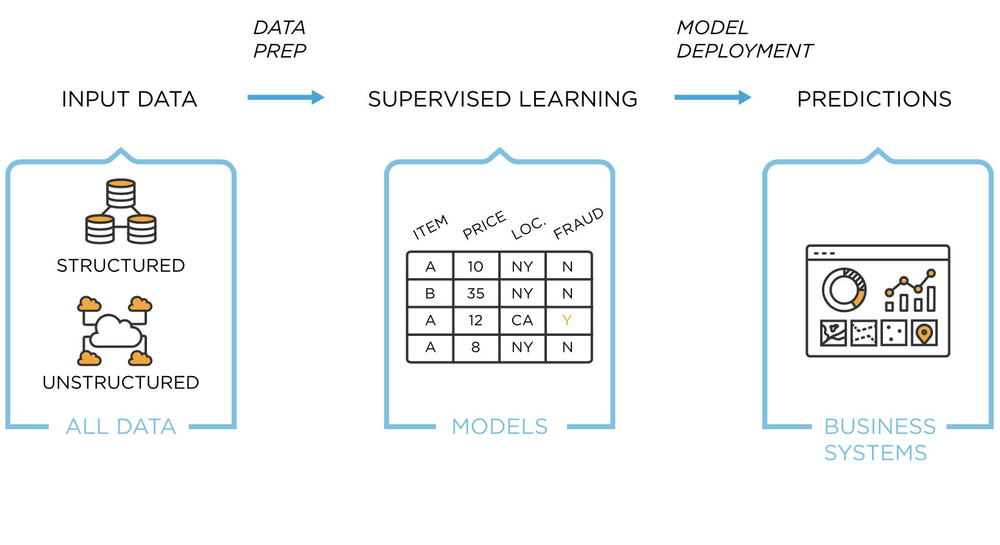

# Sena Protocol
Sena is building an automated risk advisory protocol that uses machine learning and artificial intelligence to analyze attack data and make predictions on future or possible attacks in the DeFi ecosystem. The automation is spearheaded by supervised learning, leveraging both regression and classification methods to draw out more insights on training data. 

Sena acts as an automated portifilio manager and risk analyst, mitigating the need for a DeFi consultant to do day-to-day updates on whats happening on-chain and off-chain within the DeFi ecosystem. Click here to view our whitepaper. 

Projected Launch Date: Q1 2023 - Q3 2024 
[2024 Halvening](https://www.buybitcoinworldwide.com/bitcoin-clock/)

----

This repository contains Sena's open source smart contracts, data analysis, data visulizations, and risk metrics. The value proposition for Sena is to be the DeFi risk advisory protocol to bridge the gap between DeFi entrants and DeFi risk education. The main decentralized financial services that have been explored are the following:
- Lending and Borrowing
- Derivatives (Synthetic Assets)
- Credit
- Stablecoins
- Exchanges (DEXes, CEXes, and Liquidity Trading)
- Funding
- Asset Management
- Payments
- Wallets
- Oracles
- Trading
- Insurance 
- Prediction Markets
- Risk Management
- Risk Advisory`**`
 

`**`Automated risk advisory is now being introduced by Sena Labs through Sena protocol. There are no other protocols doing what Sena does with limited liability.

----

Until now, risk advisory has been conducted by consultants whom of which, do not have the computing power or leverage to predict potential attacks in DeFi before its occurance. Sena is a prolific risk advisory protocol. The analytical architecture uses data analytics, machine learning, and the decentralized edge to make prescriptive inferences on protocols' risk tolerance. See the [Advanced Attack Analysis repo](https://github.com/SenaLabs/adv-attack-analysis.git) to view the code architecture at the back-end of Sena.

<!-- image -->

  

Source: [Supervised Learning Method](https://www.tibco.com/reference-center/what-is-supervised-learning)

The need for risk advisory and investment strategy is prevalent as the DeFi industry is growing at an exponential rate. According to [Decrypt.co](https://decrypt.co/76963/uniswaps-growth-pushes-defi-3-million-total-users), there are over 3 million DeFi users utilizing DEXs such as Uniswap, Sushiswap, dYdX, 1inch, and more, to-date(2021). By 2025 we project that number will triple as more people are attracted to Bitcoin, NFTs, smart contracts, and of course, the decentralized finance industry.

## Table of Contents
- [Contributing](#contributing)
- [Deploy Sena](#deploy-sena)
- [History of advisory mechanisms in DeFi](#history-of-advisory-mechanisms-in-defi)
- [License](#license)
- [Resources](#resources)

## Contributing
The Sena protocol is bootstrapped by initial investors and developers if you would like to investor in our protocol please visit our website. We would like to encourage you to join and contribute to our DAO, SenaDAO, which focuses on bridging the African Diaspora via e-commerce through the ETH blockchain. SenaDAO is a very important project to our community and any contribution big or small is accepted.

## Deploy Sena
How to launch Sena:
 1. Fork repository
 3. Clone repository `git clone https://github.com/SenaLabs/protocol.git`
 4. Create new branch `git checkout -b NAME_OF_YOUR_BRANCH`
 
## History of advisory mechanisms in DeFi
Traditional advisory in the DeFi ecosystem is executed by DeFi consultants who have no formal training to DeFi consultant or Expert. The DeFi industry is built by open-source, permission

## License

## Resources
If you have an inquiries please post them in the Discord channel titled "help" or send us an email at senalabsdefi@gmail.com. We will get back to you as soon as possible.
